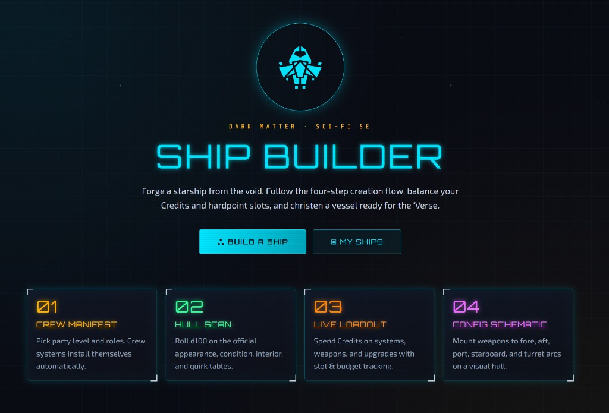
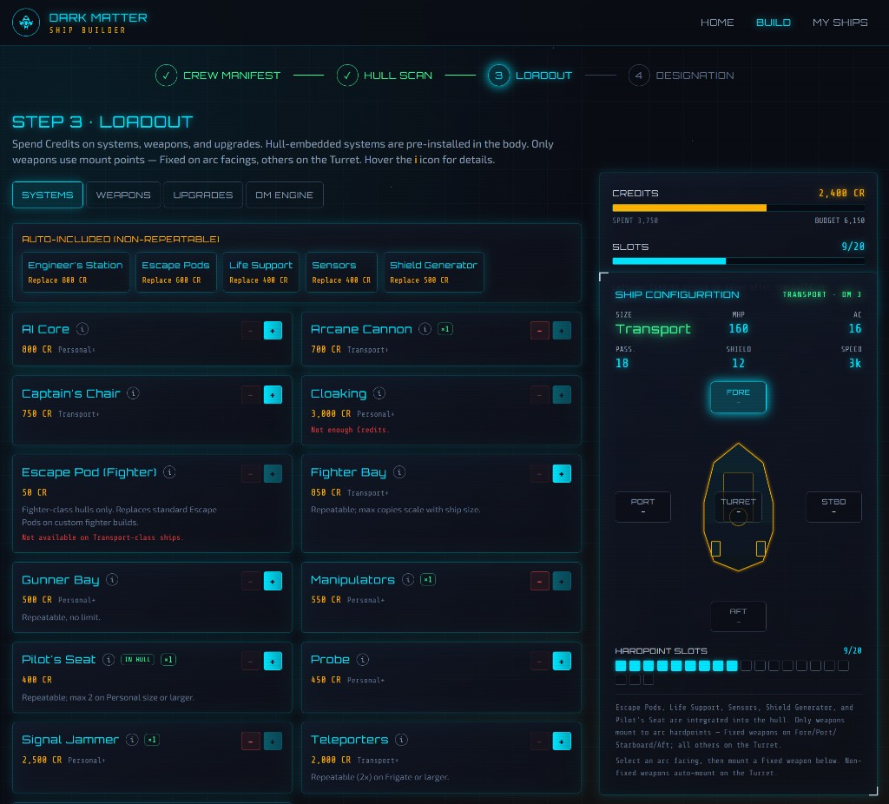
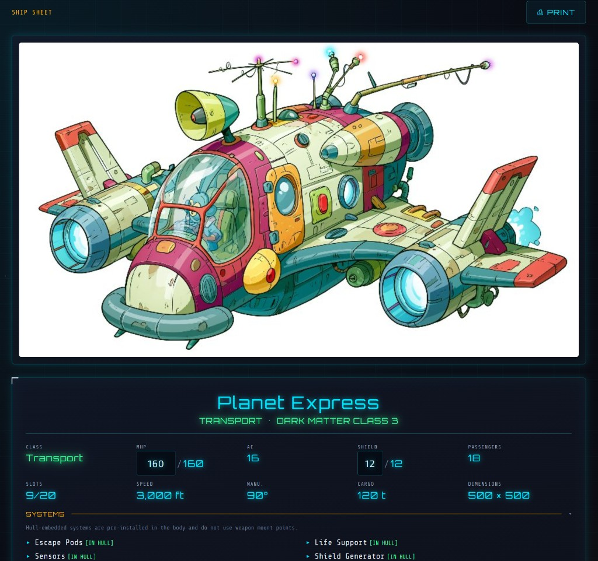
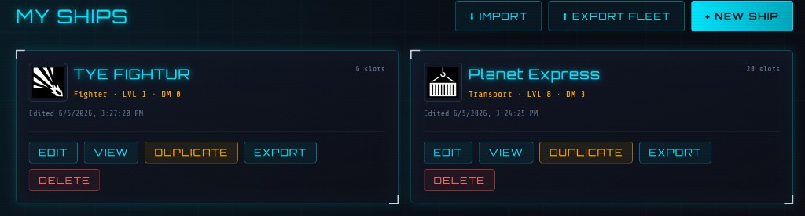
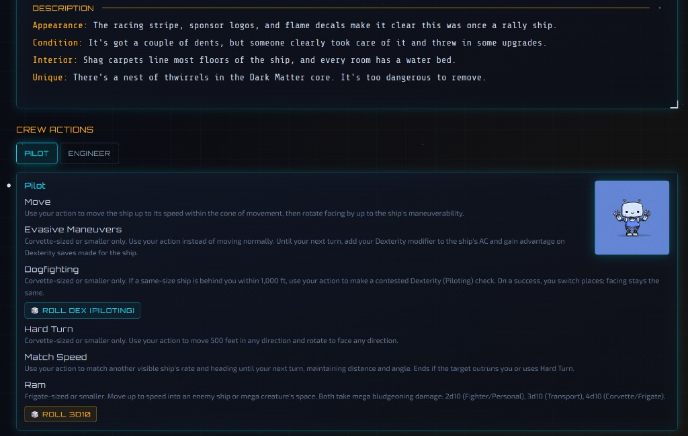

# Dark Matter // Ship Builder

A fan-made web app for building starships under the **Dark Matter Sci-Fi 5E**
ship-creation rules (Mage Hand Press, pp. 206–220). It walks your party through
the official four-step flow, enforces Credits and slot limits automatically, and
renders a finished stat block you can print or export.

The UI is styled as a starship terminal: dark panels, cyan glow, scanlines, and
a **top-down hull schematic** in the builder where weapons mount into facing
arcs.

**Live site:** https://geph.github.io/dark-matter-ship-builder/

**Current release:** v0.1



### Changelog

- **v0.1** — Initial public release: full ship builder, fighter builds and bays, crew actions, game-icons emblems, ship sheet, GitHub Pages deploy, and versioned releases.

## What it does

### Ship creation wizard

| Step | Name | What you do |
|------|------|-------------|
| 1 | **Crew Manifest** | Set party level (1–20) and player count. Pick crew roles; each role auto-installs its system for free. Optional **custom fighter build** mode (pilot only, 6 slots). |
| 2 | **Hull Scan** | Roll d100 or pick from four official flavor tables. Override any result with custom text. |
| 3 | **Loadout** | Spend Credits on systems, weapons, upgrades, and DM engine class upgrades. Configure **fighter bays** (catalog or saved custom fighters). Auto-included systems show at the top with replacement cost. GM can override the credit budget (with permission warning). |
| 4 | **Designation** | Name the ship, upload a **portrait** for the ship sheet, christen into the registry, and review the stat block. |



### Builder — Ship Configuration

The builder’s **Ship Configuration** panel shows a top-down hull with five
weapon-mount arcs:

- **Fore** · **Port** · **Starboard** · **Aft** · **Turret**

Fighter bay configuration buttons sit below hardpoint slots. Fixed-mount weapons
are restricted to appropriate arcs; fighter escape pods are never auto-installed
on motherships.



### Ship sheet (`/ship/:token`)

Read-only play sheet for a saved ship (same browser registry for localStorage):

- Full-width stat block (no hull schematic)
- Editable **MHP**, **Shield**, and **Dimensions** (click to edit; dimensions default to rulebook map size)
- Accordion sections: Systems, Weapons, Upgrades, Description
- **Crew Actions** tabbed panel with rulebook actions and roll buttons
- Optional ship portrait
- **Print** prompts whether to append crew actions after stats and description
- **Share** (copy link) only when using a **database backend** on a **public host** (see below)



### My Ships

- Edit, duplicate, delete saved builds
- Pick a **game-icons.net emblem** per ship (4,000+ icons; collapses after selection)
- Open the ship sheet view



### Rules enforcement

- Credits budget: `(1,000 + 150 × (level − 1)) × players`, with optional GM override
- Systems and weapons cost **1 slot** each; upgrades cost **0**
- Size and DM class prerequisites, repeat caps, pilot seat / fighter bay requirements
- Crew-role and starting systems are **free**
- Full fighter catalog with default loadouts; custom fighter builds sync to fighter bays

### Persistence

Ships save to your browser’s **localStorage** by default — no account or server
required.

> **Share links** only appear when `VITE_SUPABASE_URL` and `VITE_SUPABASE_ANON_KEY`
> are set (shared database) **and** the app is served on a public production URL
> (not localhost). With localStorage alone, links are device-local.

## Routes

| Path | Description |
|------|-------------|
| `/` | Landing page |
| `/build` | New ship wizard |
| `/build/:id` | Edit a saved ship |
| `/ships` | My Ships dashboard |
| `/ship/:token` | Ship sheet (stat block + crew actions) |

On GitHub Pages the app is hosted under `/dark-matter-ship-builder/`.

## Quick start

**Requirements:** Node.js 18+ and npm.

```bash
git clone https://github.com/Geph/dark-matter-ship-builder.git
cd dark-matter-ship-builder
npm install
npm run dev
```

Open **http://localhost:5173** and click **Build a Ship**.

### Production build

```bash
npm run build
npm run preview
```

GitHub Pages build (correct asset base path):

```bash
# Windows PowerShell
$env:GITHUB_PAGES='true'; npm run build

# macOS / Linux
GITHUB_PAGES=true npm run build
```

## Project structure

```
src/
  data/              # Rulebook tables (fighters, weapons, crew actions, mega spells, …)
  lib/
    rules.ts         # Budget, slots, validation, fighter bay sync
    storage.ts       # localStorage persistence (swap for Supabase)
    sharing.ts       # When share links are enabled
    useShipPrint.ts  # Print flow with optional crew actions
  components/
    ShipDiagram.tsx  # Builder hull schematic
    StatBlock.tsx    # Stat card + accordions
    CrewActionTabs.tsx / CrewActionsPrint.tsx
  pages/             # Landing, Builder, MyShips, PublicShip
public/game-icons/   # game-icons.net SVG pack + manifest
```

Game math lives in `src/lib/rules.ts`; rulebook numbers live in `src/data/*`.

## Deployment

Pushes to `main` deploy to **GitHub Pages** via
[`.github/workflows/deploy-pages.yml`](.github/workflows/deploy-pages.yml).
The footer shows the version from `package.json` (e.g. `0.1.0` → **v0.1**).

Because `main` is protected (PR + CI required), the deploy workflow does **not**
commit back to the branch. Bump the version in your PR when you want the live
site footer and README to show a new release.

In repo **Settings → Pages**, set **Source** to **GitHub Actions**.

### Updating the release version

The footer label comes from `package.json` at **build time** (e.g. `0.2.0` →
**v0.2**). The bump script does **not** change what the current deploy shows—it
records that release in the README and advances `package.json` for the *next*
deploy.

When you run `npm run version:bump` with `"version": "0.2.0"` in
`package.json`, the script:

1. Sets **Current release** in this README to **v0.2** (the version you just shipped)
2. Adds a dated line under **Changelog** for v0.2
3. Bumps `package.json` to `0.3.0` (the version slot for the next live release)

**Example:** v0.1 is already live (`package.json` is `0.1.0`). You merged a
feature branch and the site now reflects that work—you want the footer to read
**v0.2** on the next deploy.

**Step 1 — Set the version for the upcoming deploy** (in your feature PR, or a
prep commit on `main`):

```json
// package.json
"version": "0.2.0"
```

Merge the PR. GitHub Pages builds from `0.2.0` and the footer shows **v0.2**.

**Step 2 — After that deploy**, run the bump on a branch and open a PR (or add to
your next feature PR before merge):

```bash
npm run version:bump
git add package.json README.md
git commit -m "chore: record v0.2 release and bump to 0.3.0"
git push
```

That produces something like:

| File | Before | After |
|------|--------|-------|
| `README.md` | **Current release:** v0.1 | **Current release:** v0.2 + changelog entry |
| `package.json` | `"0.2.0"` | `"0.3.0"` |

Merge the bump PR. The site stays on **v0.2** until a later PR changes
`package.json` to `0.3.0` and deploys again.

**First release from a fresh clone** (`0.1.0` already in repo): merge to deploy
**v0.1**, then run `npm run version:bump` once so the repo moves to `0.2.0` for
the next cycle.

**Tip:** Never run `version:bump` in the same commit that introduces a new
`package.json` version you want to go live—the bump advances the file *past*
the release you are documenting.

## Optional: Supabase backend

To persist ships across devices and enable **Share** on a public deployment:

1. Create a `ships` table matching `Ship` in `src/lib/types.ts`.
2. `npm install @supabase/supabase-js`
3. Set `VITE_SUPABASE_URL` and `VITE_SUPABASE_ANON_KEY` in `.env` (git-ignored).
4. Reimplement storage in `src/lib/storage.ts` against Supabase.
5. Deploy to a public URL (GitHub Pages, Vercel, Netlify, etc.).

## Tech stack

- React 19 + React Router 7
- Vite 8 + TypeScript
- Tailwind CSS 4

## Credits

Game content © Mage Hand Press, *Dark Matter Sci-Fi 5E*. Ship and UI icons from
[game-icons.net](https://game-icons.net/) (CC BY 3.0), including Delapouite’s
spaceship. This is a fan-made tool and is not affiliated with or endorsed by the
publisher.
